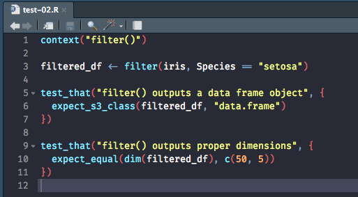
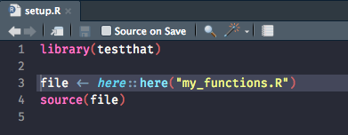
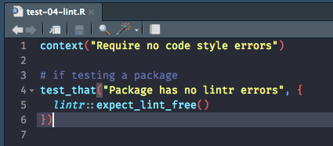

<!-- README.md is generated from README.Rmd. Please edit that file -->

# Unit Testing in R

## Problem Statement

An important part of writing code is to ensure it functions as expected
and, as we make updates, the functionality doesn’t break. To help
minimize these risks we should always include unit testing in our code.
Moreover, unit testing should be incorporated and automated for not only
R packages but also individual scripts.

## Suggested Solutions

There are several packages and functions that provide various
capabilities in the unit testing toolchain. The following provides a
synopsis of the most commonly used and the sections that follow discuss
how and when to implement them:

  - **R CMD check**: always run `R CMD check` to test the overall
    structure and functionality of your R package. It will also run any
    unit testing embedded in your package.
  - **testthat**: probably the most comprehensive and commonly used
    package for unit testing.
  - **tinytest**: a lightweight alternative for unit testing when you’re
    objective is to minimize dependencies, maximize CI/CD speed, and
    also deploy tests with a package.
  - **lintr**: linting package that checks adherence to a given style,
    syntax errors and possible semantic issues.
  - **mockery**: package that provides mocking functionality within unit
    tests.
  - **covr**: package that tracks test coverage for your R package.

## Directory Layout

The most common approach, whether you are testing an R package,
individual scripts or a directory of scripts, is to have unit tests
separated into their own subdirectory from the root of the project
directory. For example, if you have a set of functions
(`my_functions.R`) and a script that does analysis (`sample_script.R`)
you would include any unit tests in a subdirectory.

    #> .
    #> ├── my_functions.R
    #> ├── sample_script.R
    #> └── tests

Likewise, when unit testing an R package, we typically isolate tests
into their own subdirectory as illustrated below:

    #> examplepkg
    #> ├── DESCRIPTION
    #> ├── LICENSE.md
    #> ├── NAMESPACE
    #> ├── R
    #> ├── man
    #> └── tests

This is not always necessary. For example, we can embed unit tests
directly in the source file for the function being tested or in analysis
scripts. This may have the benefit of aligning tests right next to the
functionality being tested; however, the above approach is the most
common and most organized structure.

## Testing Packages

Most people get exposed to code testing when first developing an R
package. An R package has very specific structure and documentation
requirements so testing is essential to ensure your package can be
submitted to CRAN or to even make sure it will operate correctly when
used.

### R CMD check

`R CMD check` is a key component of testing your package. `R CMD check`
is actually the name of the command you run from the terminal.
Historically, when building an R package, you would first create the
package, convert it to the .tar.gz file, run `R CMD check
pkgname.tar.gz`, and if everything passes you would submit to CRAN.

However, most people do not run it directly in the terminal. Rather they
run it interactively using `devtools::check()`. In some cases you may
need to run `R CMD check` programmatically and not in an interactive
session. To do so, you can use `rcmdcheck::rcmdcheck()`. This will
capture the results of `R CMD check` as an object which can then be
queried and investigated. In both cases ( `devtools::check()` and
`rcmdcheck::rcmdcheck()`), you do not need to build the .tar.gz file;
rather, you can just run the function on the root of the package and it
will build the .tar.gz and then run `R CMD check`.

Running `R CMD check` will actually perform over 50 individual checks
covering:

  - Package metadata (i.e. version number)
  - Package structure (i.e. directory layout, size, executable files)
  - DESCRIPTION file (i.e. meta-info, package dependencies)
  - Namespace (i.e. does it exist, is it parseable)
  - R code (i.e. syntax errors, function dependencies)
  - Data (i.e. if a data directory exists is it set up properly)
  - Documentation (i.e. function documentation, cross-references)
  - Compiled code (i.e. existance and functionality of C/C++, Fortran)
  - Tests (i.e. each file in a `test/` or `tests/` subdirectory is run)
  - Vignettes (i.e. build and check that vignettes run)

For more detailed information on what gets tested in each of these areas
see section [17.2](https://r-pkgs.org/r-cmd-check.html#check-checks) in
the [*R Packages*](https://r-pkgs.org/) book.

One thing to note, if you have tests developed in the `tests/` directory
of a package, then running `R CMD check` will run these tests and run
all the other checks on the package. However, as you will see shortly,
there are other ways to run the tests separately from `R CMD check` that
provides you more flexibility.

### Unit testing packages with testthat

As previously mentioned, when unit testing an R package, we typically
isolate unit tests into their own `tests/` subdirectory. The most common
way to unit test R packages is to use the
[**testthat**](https://testthat.r-lib.org/) package. When using
**testthat** in a package we set up our `tests/` directory as follows
and we also need to add testthat as a Suggests in the DESCRIPTION file.
You can easily set up this structure using `usethis::use_testthat()`.

    #> examplepkg/tests
    #> ├── testthat
    #> └── testthat.R

Within the `tests/` directory, you’ll see a `testthat.R` file and a
`testthat` directory. The `testthat.R` file is a file you will rarely
edit, but it needs to be there because this is what will get run when
you run `R CMD check`. You’ll see one function in this file
(`test_check("examplepkg")`), which directs `R CMD check` to run all the
tests in the `testthat` subdirectory.

If you are running tests interactively (from the console), then you can
just run `devtools::test()` and it will run and report test results.

So all the unit test magic will be contained in the `tests/testthat/`
subdirectory. If we look at this subdirectory we see what a typical
directory layout looks like.

    #> examplepkg/tests
    #> ├── testthat
    #> │   ├── helper.R
    #> │   ├── setup.R
    #> │   ├── teardown.R
    #> │   ├── test-01-header.R
    #> │   ├── test-02-filter.R
    #> │   ├── test-03-summarize.R
    #> │   ├── test-04-lint.R
    #> │   └── test-05-demo-failure.R
    #> └── testthat.R

You’ll notice 4 classes of .R files in this directory:

1.  Test files start with “test” and are executed in alphabetical order.
    This is where all your unit tests will reside. How you split up your
    tests across multiple scripts is up to you.
2.  Helper files start with “helper” and are executed before tests are
    run. If you have special custom functions that are used only during
    testing then you will want to place them here rather than in the
    package `R/` directory.
3.  Setup files start with “setup” and are executed before tests. If you
    have certain environment variables, data, or other items that will
    be used across all your tests then its best to place them here.
4.  Teardown files start with “teardown” and are executed after the
    tests are run. Often, if you are setting up a special environment in
    a “setup” file then you will likely want to close that environment
    down after testing.

You do not need all these types of files. In fact, in many packages you
will simply see the “test-xx.R” files. You can run Within a “test-xx.R”,
we typically have the following structure:

<!-- -->

where

  - `context()` defines a set of tests that test related functionality.
    Usually you will have one context per file, but you may have
    multiple contexts in a single file if you so choose. This is mainly
    useful when reporting test results as it allows you to see how many
    tests are run, and their results, for specific functionality being
    tested. If you do not include `context()` then the name of the test
    file will be used as the context.
  - `test_that()` encapsulates a series of expectations about small,
    self-contained set of functionality. Each test is contained in a
    context and can contain one or multiple expectations.
  - `expect_xxx()` are the actual unit tests being run. All expectations
    begin with `expect_` and you can even create your own [custom
    expectations](https://testthat.r-lib.org/articles/custom-expectation.html).

We can run these tests multiple ways. Most often we run them with
`devtools::test()` (assuming you are in the package root directory). We
can have the results reported in multiple ways. By default it will
report detailed results. Note that results can be “OK”, “F” for failure,
“W” for warning, and “S” for skipped.

**Note**: I have added a test to purposefully for demonstration reasons.

``` r
> devtools::test()
Loading examplepkg
Testing examplepkg
✔ |  OK F W S | Context
✔ |   2       | header()
✔ |   2       | filter()
✔ |   2       | summarize()
✔ |   1       | Require no code style errors [1.0 s]
✖ |   0 1     | Demonstrate a test that fails
────────────────────────────────────────────────────────────────────
test-05-demo-failure.R:4: failure: dummy test to signal failure
FALSE isn't true.
────────────────────────────────────────────────────────────────────

══ Results ═════════════════════════════════════════════════════════
Duration: 1.0 s

OK:       7
Failed:   1
Warnings: 0
Skipped:  0
```

We can also adjust the reporting mechanism to get minimal results
reported:

``` r
> devtools::test(reporter = "minimal")
Loading examplepkg
Testing examplepkg
.......F
```

Run silently but gather the results to be reported elsewhere:

``` r
> devtools::test(reporter = "silent")
```

So other options with
`?Reporter`.

### Unit testing packages with tinytest

[**tinytest**](https://github.com/markvanderloo/tinytest/blob/master/pkg/README.md)
is an alternatative testing package that is lightweight and has no
dependencies. This can be helpful when trying to minimize recursive
dependencies and speeding up compute time:

``` r
compare <- itdepends::dep_weight(c("testthat", "tinytest"))

# dependencies
compare[["user_deps"]]
#> $testthat
#> [1] "cli"        "crayon"     "digest"     "evaluate"   "magrittr"   "praise"     "R6"        
#> [8] "rlang"      "withr"      "assertthat"

$tinytest
#> character(0)

# compare installation time
# left=testthat; right=tinytest
compare[["install_self"]]
#> [1] 35.97  2.35
```

For the most part, **tinytest** has a similar setup approach as
**testthat**:

1.  a tinytest.R file goes into the `tests/` directory. This directs `R
    CMD check` to run the tinytests.
2.  place all tests, or scripts that have unit tests embedded in them,
    in the `inst/tinytest` directory. This is different than
    **testthat**, which places all testing scripts in `tests/testthat`
    directory. This allows all tests to be shipped with the package,
    which allows end-users to also run tests.
3.  individual test files are R scripts that start with `test_xxx.R` and
    include expectations (unit tests) such as
    `expect_equal(myfunc(1), 0)`.

To set up the proper baseline needs in your package for using
**tinytest** just run `tinytest::setup_tinytest("packagedirectory")`. To
see more details on how **tinytest** works check out this
[overview](https://github.com/markvanderloo/tinytest/blob/master/pkg/README.md)
and also see how its implemented in the
[pdp](https://github.com/bgreenwell/pdp/tree/master/inst/tinytest) R
packge.

## Testing for Non-packages

If you need to test a single script or possibly a directory of R code,
you can still use **testthat** and **tinytest**. The process remains the
same. For example, say we have a directory with some custom functions
and some analysis script. We can still set up a subdirectory that
contains our testing scripts.

    #> .
    #> ├── my_functions.R
    #> ├── sample_script.R
    #> └── tests
    #>     ├── helper.R
    #>     ├── setup.R
    #>     ├── teardown.R
    #>     ├── test-01-header.R
    #>     ├── test-02-filter.R
    #>     ├── test-03-summarize.R
    #>     ├── test-04-lint.R
    #>     └── test-05-demo-failure.R

In this case, we only need the test files, any setup, helper, and
teardown files. We do not need to the top level `testthat.R` or
`tinytest.R` file since we do not run `R CMD check` on non-package level
code.

In this case, to test our function created in `my_functions.R` we just
need to source them in the `setup.R` file so that they are available to
be used across all unit test scripts. Note: `here::here()` simply finds
the path to the root of the .RProj for this R project.

<!-- -->

Implementation of our unit test is no different than demo’d in the
package section. We can then run our tests using `testthat::test_dir()`
to test the directory where all tests reside (or even
`testthat::test_file()` if you only have on file with all the test
requirements).

``` r
testthat::test_dir("tests")
✔ |  OK F W S | Context
✔ |   2       | header()
✔ |   2       | filter()
✔ |   2       | summarize()
✔ |   1       | Require no code style errors [0.2 s]
✖ |   0 1     | Demonstrate a test that fails
───────────────────────────────────────────────────────────────────────────
test-05-demo-failure.R:4: failure: dummy test to signal failure
FALSE isn't true.
───────────────────────────────────────────────────────────────────────────

══ Results ════════════════════════════════════════════════════════════════
Duration: 0.3 s

OK:       7
Failed:   1
Warnings: 0
Skipped:  0
```

As illustrated early, we can use special reporters in our
`testthat::test_dir()` call to change how results are reported:

``` r
# only provide output if a test fails
testthat::test_dir("tests", reporter = "fail")
#> Error: Failures detected.
```

## Linting

[Linting](https://en.wikipedia.org/wiki/Lint_\(software\)) is the
process of analyzing source code to flag programming errors, bugs,
stylistic errors, and suspicious constructs. Within R, the
[**lintr**](https://github.com/jimhester/lintr) package checks adherence
to a given style, syntax errors and possible semantic issues.

**lintr** will check for many common programmatic deviations
(i.e. syntax errors, absolute paths). It will also look for opinionated
style formatting. Probably the most widely accepted and used style guide
is [Hadley Wickham’s R Style Guide](http://r-pkgs.had.co.nz/style.html).
However, realize that you can turn-off certain linters. See
[here](https://github.com/jimhester/lintr) for available linters that
can be turned on or off.

To perform linting on a package, you can execute `lintr::lint_package()`
on the root path of the package. It will apply the linters to all the R
files in the package. You can also automate this process within unit
testing by including a unit test that uses `lintr::expect_lint_free()`.

<!-- -->

Now when you run your unit tests you will have a separate testing line
item for code style. See the 4th test line item below:

``` r
devtools::test("examplepkg")
Loading examplepkg
Testing examplepkg
✔ |  OK F W S | Context
✔ |   2       | header()
✔ |   2       | filter()
✔ |   2       | summarize()
✔ |   1       | Require no code style errors [1.0 s]
✖ |   0 1     | Demonstrate a test that fails
──────────────────────────────────────────────────────────────────────────────────
test-05-demo-failure.R:4: failure: dummy test to signal failure
FALSE isn't true.
──────────────────────────────────────────────────────────────────────────────────

══ Results ═══════════════════════════════════════════════════════════════════════
Duration: 1.0 s

OK:       7
Failed:   1
Warnings: 0
Skipped:  0
```

When linting individual files or directories (rather than a package), we
can execute `lintr::lint()` on the file or `lintr::lint_dir()` on the
directory. The results are silent if no problems exist otherwise, by
default, they will show up in the R console. You can also use `cache =
TRUE` to store the linting results as a cache in the directory.

The following lints the `my_functions.R` file. Since there are no errors
the results are silent.

``` r
lintr::lint("my_functions.R")
```

## Mocking

Sometimes we need to mock functionality in our code. Most commonly,
[mocking](https://en.wikipedia.org/wiki/Mock_object) is the act of
simulating an object that mimics the behavior of real objects. This can
as complex as mocking that a system is Windows versus Linux or as simple
as mocking that a certain environment variable is a specific value.

A recent [blog post](https://blog.r-hub.io/2019/10/29/mocking/) provides
an excellent summary of the R resources available for mocking. However,
probably the most commonly used package for mocking is
[**mockery**](https://github.com/r-lib/mockery).

For example, say your company operates on on-prem servers and in the
cloud. You may have a package that can be used in both environments but
requires slight differences based on which one the user is operating. We
can simulate with the following
function:

``` r
# a function that does one thing on a Windows OS and does another for all other 
# OS's
my_function <- function() {
  if (Sys.info()[["sysname"]] == "Windows") {
    return("Do A")
  } else {
    return("Do B")
  }
}
```

I’m currently working on a Mac OS…

``` r
Sys.info()[["sysname"]]
#> [1] "Darwin"
```

so this function would…

``` r
my_function()
#> [1] "Do B"
```

However, when testing we may want to mock a Windows OS to ensure certain
errors occur or for other reasons. To do so we “stub” our function with
`mockery::stub()` and specify:

  - `where`: the function where we want to mock some value
  - `what`: name of the underlying function within `where` that you want
    to override the object value
  - `how`: replacement function or value to use instead of the actual
    value provided by `what`

<!-- end list -->

``` r
mockery::stub(
   where = my_function,
   what = "Sys.info", 
   how = c(sysname = "Windows")
   )

# Different output
my_function()
#> [1] "Do A"
```

Note, this only mocks `Sys.info` in the local environment but does not
actually change `Sys.info`:

``` r
Sys.info()[["sysname"]]
#> [1] "Darwin"
```

## Understanding Coverage

The [**covr**](https://github.com/r-lib/covr) package provides a
framework for measuring unit test coverage. We can measure coverage for
both packages and also for unit testing on .R files.

For example, say we want to test the test coverage for the
`my_functions.R` script. In this case I get the test files relevant for
this script. Here I simply exclude the last test file since it was
simply to demo what happens when a test has an error.

``` r
test_paths <- file.path("tests", list.files("tests"))[1:7]
```

Next, we use `covr::code_coverage` and specify the file of interest
along with the test files to apply. The results indicate 100% test
coverage.

``` r
covr::file_coverage(source_files = "my_functions.R", test_files = test_paths)
#> Coverage: 100.00%
#> my_functions.R: 100.00%
```

We can also test a package using
`covr::package_coverage("pkg_directory)`:

``` r
covr::package_coverage("examplepkg")
#> examplepkg Coverage: 100.00%
#> R/my-functions.R: 100.00%
```

When using [Travis-CI](https://travis-ci.org/) you can track your
coverage with [Codecov](https://codecov.io/). See
[here](https://github.com/r-lib/covr) for details. When working with
Azure DevOps pipeline you can use the following to run covr on a package
and output the results in a `coverage.xml` file so it is available in
the Azure Pipelines for reporting.

``` r
covr::azure("examplepkg")
```
